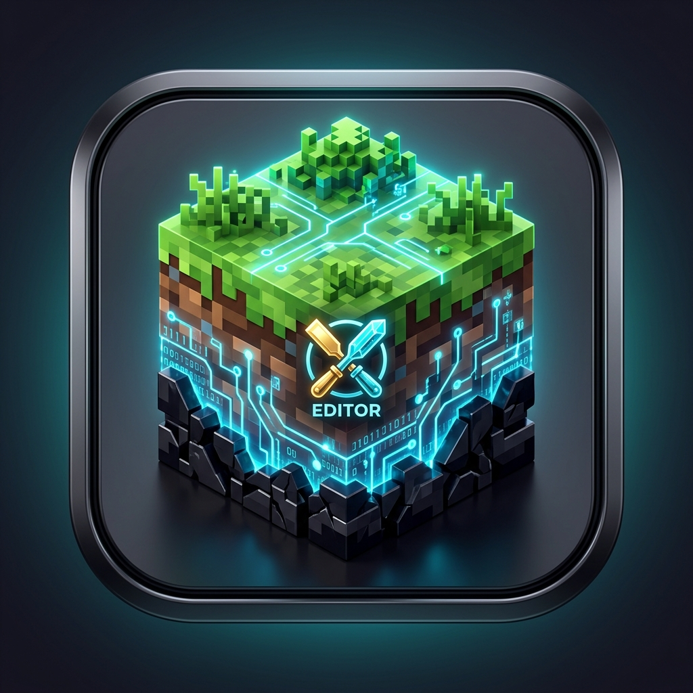

<div align="center">

# 🌲 NX Editor (NX 存档与 NBT 编辑器)

**专为 Minecraft 基岩版 (Bedrock Edition) 打造的下一代高性能全平台存档与 NBT 数据库编辑器**

[](https://flutter.dev)
[](https://dart.dev)
[](#-多平台支持与编译)
[](LICENSE)
[](https://github.com/xin-build/NX-Editor/actions)

<br/>



<br/><br/>

[✨ 核心功能](#-核心功能亮点) •
[📱 移动端与桌面适配](#-响应式设计与交互) •
[🛠️ 架构与技术细节](#-技术架构与引擎实现) •
[📦 下载与安装](#-下载与编译) •
[🤝 开源与贡献](#-开源协议)

</div>

---

## 🌟 核心功能亮点

### 1. 🗺️ 高性能 2D 地图渲染视口
- **多维度原生渲染**：完美支持主世界 (Overworld)、下界 (Nether 切片高度截面)、末地 (The End) 3 大维度无缝切换。
- **立体地形高度阴影**：基于高度图差分自适应光影算法，直观呈现山川、峡谷、丘陵立体质感。
- **史莱姆区块 (Slime Chunk) 计算器**：原生集成 Mojang 随机数哈希算法，自动限制仅在主世界生效，支持未生成区块预计算与区块网格联动。
- **88+ 原生生物群系色谱渲染**：内置完整群系调色板与材质图标，支持群系边缘平滑渲染与生物群系 ID 速查。
- **多图层叠加**：区块边界网格、史莱姆区块覆盖层、光照图层、玩家标记、自定义标注点。

### 2. 🗄️ 全功能 NBT 数据库与 LevelDB 键值编辑器
- **全 12 种 Minecraft 原生标签类别支持**：
  `TAG_Byte`、`TAG_Short`、`TAG_Int`、`TAG_Long`、`TAG_Float`、`TAG_Double`、`TAG_Byte_Array`、`TAG_String`、`TAG_List`、`TAG_Compound`、`TAG_Int_Array`、`TAG_Long_Array`。
- **完整操作菜单**：
  - 📥 **导入 NBT 文件**：支持 `.nbt` / `.dat` / `.schem`，智能剥离 Bedrock Header 并解压 GZIP/ZLIB，提供“完全覆盖”或“合并键值”模式；
  - 📤 **导出 NBT 文件**：支持导出整树或将任意子 Compound/List 导出为独立二进制文件；
  - ➕ **新建标签**：配备专属类型彩色徽章、数据范围说明与智能初始值校验；
  - 📄 **标签复制与跨节点挂载**：内存深度克隆 + 系统剪贴板 JSON/SNBT 双通道复制，支持一键挂载到任意目标路径（带重名冲突保护）；
  - 🗑️ **删除标签与撤销保护**：每次删除均推入事务历史栈，随时一键恢复。
- **专用数据编辑器**：针对 `level.dat`、玩家背包/末影箱/属性数据、方块实体、实体 ActorPrefix 提供专属可视化表单。

### 3. 📡 实体与生物雷达扫描器 (Entity Radar)
- 快速扫描并分类地图中已加载区块的所有生物、怪物、NPC 与掉落物；
- 提供坐标指示、生命值查看与一键在地图视口中平滑定位导航。

### 4. 🌍 自定义超平坦世界生成器 (Superflat Generator)
- 完整支持 Bedrock 1.18+ 深板岩负高度区间（`Y = -64` 到 `Y = 320`）；
- 支持全量 88+ 生态群系选择、地层厚度拖拽重排与方块调色板可视化挑选。

### 5. 🛡️ 内存事务层与物理安全保护
- **全量撤销/重做 (Undo / Redo)**：所有地图方块编辑、选区操作与 NBT 增删改均纳入事务历史栈；
- **非破坏性编辑与自动备份**：打开存档时自动创建增量快照，手动点击保存前不篡改磁盘原始文件。

---

## 📱 响应式设计与交互

NX Editor 经过全界面深度响应式重构，完美兼容手机、平板、折叠屏与桌面宽屏：

- **桌面宽屏 (>= 800px)**：提供左侧分类树 + 右侧专业编辑区的多栏分屏工作台；
- **移动端 (< 800px)**：
  - 顶部双 Tab 分页（`目录` ↔ `数据编辑`），条目选择后平滑滑动；
  - 底部自适应悬浮抽屉：支持手势自由拖拽无级调节高度（18% ~ 90%）与双击高度切换；
  - 顶栏直接常驻 **定位**、**撤销 (Ctrl+Z)**、**重做 (Ctrl+Y)** 与 **保存 (Ctrl+S)** 核心操作。

---

## 🛠️ 技术架构与引擎实现

```
NX-Editor/
├── lib/
│   ├── leveldb/                      # 纯 Dart 实现的 LevelDB SSTable (.ldb) 读写引擎 (免 C++ 动态库依赖)
│   │   ├── leveldb_reader.dart       # 支持 ZLIB_RAW (ctype=4) 与 ZLIB (ctype=2) 解压
│   │   └── leveldb_writer.dart       # SSTable 块构造与 BlockBuilder 回写器
│   ├── nbt/                          # 基岩版小端 NBT 协议层
│   │   ├── nbt_tags.dart             # 12 种 NBT 标签类型定义与格式化元数据
│   │   ├── nbt_parser.dart           # Little Endian 二进制解析与自动解压 (GZIP/ZLIB/Header)
│   │   └── nbt_clipboard.dart        # 标签深度克隆剪贴板单例
│   ├── render/                       # 2D 地图视口与 GPU 瓦片渲染管线
│   │   ├── gpu_tile_renderer.dart    # 区块瓦片分块渲染与高度光影
│   │   └── map_viewport_controller.dart # 视口平移、缩放与坐标变换
│   ├── screens/                      # 各功能顶级全屏视图
│   │   ├── editor_main_screen.dart   # 主地图工作台
│   │   ├── nbt_editor_full_screen.dart # 全功能数据库/NBT 编辑器
│   │   ├── create_flat_screen.dart   # 自定义超平坦生成器
│   │   └── world_list_screen.dart    # 存档列表与管理
│   ├── data/
│   │   └── data_manager.dart         # 全局数据流、事务栈、快照与持久化
│   └── main.dart                     # 应用程序入口与主题配置
└── .github/workflows/release.yml     # GitHub Actions 全平台多架构云端自动构建流
```

---

## 📦 下载与编译

### 1. 直接下载最新发布版
请前往 [GitHub Releases](https://github.com/xin-build/NX-Editor/releases) 页面下载适合您设备的预编译安装包：
- **Windows (x64)**：`NX-Editor-Windows-x64.zip`
- **Android**：`NX-Editor-Android-APK.apk`
- **Linux (x64)**：`NX-Editor-Linux-x64.tar.gz`
- **macOS**：`NX-Editor-macOS.zip`
- **iOS**：`NX-Editor-iOS.ipa`

---

### 2. 从源码本地构建

#### 前置要求
- [Flutter SDK](https://flutter.dev) >= 3.29.0
- Dart SDK >= 3.8.0

#### 构建步骤
```bash
# 1. 克隆代码仓库
git clone https://github.com/xin-build/NX-Editor.git
cd NX-Editor/flutter_app

# 2. 安装依赖
flutter pub get

# 3. 运行自动化测试 (10/10 单元测试)
flutter test

# 4. 本地打包指定平台
# Windows:
flutter build windows --release

# Android:
flutter build apk --release

# Linux:
flutter build linux --release

# macOS / iOS:
flutter build macos --release
flutter build ios --release --no-codesign
```

---

## 🤝 开源协议

本项目基于 [MIT License](LICENSE) 开源发布。欢迎提交 Issue 与 Pull Request 共同改进！
